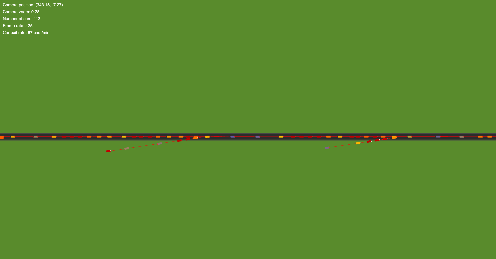

# **p5.js Traffic Simulation**

This project is a traffic simulation built using [p5.js](https://p5js.org/). The simulation creates cars that follow a straight road and dynamically avoid collisions. The cars accelerate and decelerate based on the distance to other cars, and their speed is visualized through color transitions.



## **Features**

- Cars are rendered on a canvas and follow a road represented by nodes.
- Dynamic collision avoidance and speed adjustment for cars based on their surroundings.
- Adjustable camera controls for zooming and panning.
- Real-time heads-up display (HUD) showing various statistics such as car count and frame rate.

## **Project Structure**

```
project/
├── index.html                # Main HTML file to run the project
├── js/
│   ├── sketch.js             # Main entry point of the project, handles p5.js setup and draw loop
│   ├── car.js                # Car class definition and related logic
│   ├── roadnode.js           # RoadNode class definition for creating and managing road nodes
│   ├── utils.js              # Utility functions (e.g., calculating angles between positions)
│   ├── constants.js          # Constants used across the project (e.g., pixelsPerMeter, time step)
├── css/
│   └── styles.css            # (Optional) CSS file for any styling (currently not used)
└── README.md                 # Project documentation
```

## **Setup and Installation**

To run this project locally, you need to serve the files using a local web server because p5.js instance mode and ES6 modules require it for proper functionality.

### **1. Clone the repository**

Clone this project to your local machine using the following command:

```bash
git clone <repository-url>
```

Replace `<repository-url>` with the URL of your repository.

### **2. Install a Local Web Server**

You can use Python or Node.js to create a local server:

#### **Option A: Using Python**

If you have Python installed, run the following command in your project directory:

```bash
# For Python 3
python3 -m http.server 8000

# For Python 2
python -m SimpleHTTPServer 8000
```

#### **Option B: Using Node.js**

If you have Node.js installed, you can use `http-server`:

1. Install `http-server` globally (if not already installed):

   ```bash
   npm install -g http-server
   ```

2. Run the server in your project directory:

   ```bash
   http-server -p 8000
   ```

### **3. Open in Browser**

Once your local server is running, open your browser and navigate to:

```
http://localhost:8000
```

The p5.js simulation should load and start running.

## **Controls**

- **Mouse Drag**: Click and drag to pan the camera view.
- **Mouse Wheel**: Scroll up or down to zoom in or out.

## **Code Organization**

- **`sketch.js`**: Contains the main logic for the p5.js setup and draw functions. It also handles camera controls and manages car and road node updates.
- **`car.js`**: Defines the `Car` class, including the car's position, velocity, steering, and collision detection logic.
- **`roadnode.js`**: Defines the `RoadNode` class, representing nodes along the road that cars navigate towards.
- **`utils.js`**: Contains utility functions such as `angleTowards` to calculate angles between vectors.
- **`constants.js`**: Stores constants like `pixelsPerMeter` and `dt` (time step), which are shared across multiple files.

## **Future Improvements**

Here are some potential enhancements that could be made to the project:

- Enable the use of configurable simulation files that save information such as
  - Car spawning parameters
    - Car parameters (speed, acceleration, braking distance)
    - Spawn locations
    - Spawning rate
  - Road layout
  - etc.
- Improve car braking dynamic to match speed of leading car instead of maximum braking
- Improve on ramps to facilitate more civilized merging

## **Dependencies**

- [p5.js](https://cdnjs.cloudflare.com/ajax/libs/p5.js/1.6.0/p5.js): A JavaScript library for creative coding.
- A local web server to serve the ES6 module-based project.